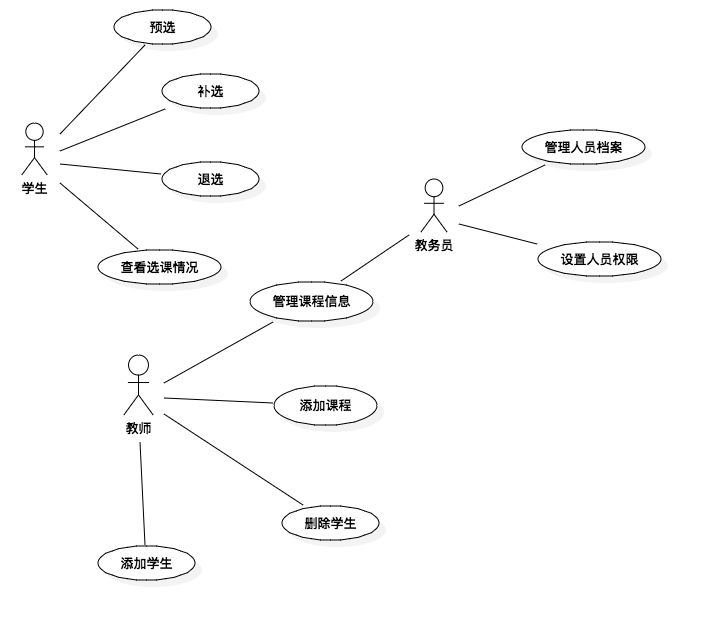

# 选课系统需求分析报告

[选课系统需求描述](https://github.com/Ashlee1994/OO/blob/master/%E4%BD%9C%E4%B8%9A2%EF%BC%9A%E9%80%89%E8%AF%BE%E7%B3%BB%E7%BB%9F%E9%9C%80%E6%B1%82%E8%AF%B4%E6%98%8E%E4%B9%A6.pdf)

[选课系统涉众分析报告](https://github.com/locusxt/oo/blob/master/hw3/%E6%B6%89%E4%BC%97%E5%88%86%E6%9E%90%E6%8A%A5%E5%91%8A.md)

## 1. 系统目标

本系统的设计目标是协助学生提高选课效率以及准确率，以网页方式呈现学生选课系统，提供学生选课在线数字平台。

## 2. 业务参与者

- 学生
- 教师
- 教务员
- 管理员（经过协商删除了该参与者）

## 3. 业务用况

### 3.1 用况图

### 3.2 用况描述

 #### 预选

| 用况名称   | 预选                                       |
| ------ | ---------------------------------------- |
| 用况描述   | 学生根据相关要求选择自己希望选修的课程                      |
| 执行者    | 学生                                       |
| 前置条件   | ①学生已经登录 ②当前是预选时间 ③学生可以选修该课程        |
| 后置条件   | ①成功预选相应课程                                |
| 主过程描述  | 1. 学生用自己账号密码登录选课系统，成功登录执行2，否则执行异常过程1.1.1 2. 如果当前不在预选时间内，执行异常过程2.1.1 3. 学生浏览自己可以选修的课程，选择希望选修的课程加入预选列表。如果该课程与已经预选的课程冲突，执行异常过程3.1.1；如果选修该课程后，总学分超过上限，执行异常过程3.1.2；否则，执行4 4. 系统将该课程加入预选列表，用况结束 |
| 分支过程描述 | 无                                        |
| 异常过程描述 | 1.1.1登录异常，提示登录失败，用况结束 2.1.1预选失败，提示当前不在预选时间段，用况结束 3.1.1预选失败，提示与已经预选的课程冲突，用况结束 3.1.2预选失败，提示选课学分超过上限，用况结束 |
| 业务规则   | 1-rule001 2-rule005 3-rule002 3-rule003 |

 #### 补选

| 用况名称   | 补选                                       |
| ------ | ---------------------------------------- |
| 用况描述   | 预选结束后，学生根据相关要求补选自己希望选修的课程                |
| 执行者    | 学生                                       |
| 前置条件   | ①学生已经登录 ②学生可以选修该课程 ③选课人数未达上限       |
| 后置条件   | ①成功补选相应课程                                |
| 主过程描述  | 1. 学生用自己账号密码登录选课系统，成功登录执行2，否则执行异常过程1.1.1 2. 如果当前不在补选时间内，执行异常过程2.1.1 2. 学生浏览自己可以补选的课程，选择希望选修的课程加入预选列表。如果该课程与已经预选的课程冲突，执行异常过程3.1.1；如果选修该课程后，总学分超过上限，执行异常过程3.1.2；如果学生提交请求时，选课人数已满，执行异常过程3.1.3；否则，执行4 4. 系统将该课程加入选课列表，用况结束 |
| 分支过程描述 | 无                                        |
| 异常过程描述 | 1.1.1登录异常，提示登录失败，用况结束 2.1.1补选失败，提示当前不在补选时间用况结束 3.1.1补选失败，提示与已经预选的课程冲突，用况结束 3.1.2补选失败，提示选课学分超过上限，用况结束 3.1.3补选失败，提示选课人数已满，用况结束 |
| 业务规则   | 1-rule001 2-rule005 3-rule002 3-rule003 3-rule004 |

#### 退选

| 用况名称   | 退选                                       |
| ------ | ---------------------------------------- |
| 用况描述   | 学生退选自己不想再选的课程                            |
| 执行者    | 学生                                       |
| 前置条件   | ①学生已经登录 ②学生可以退选该课程                    |
| 后置条件   | ①成功退选相应课程                                |
| 主过程描述  | 1. 学生用自己账号密码登录选课系统，成功登录执行2，否则执行异常过程1.1.1 2. 如果当前不在退选时间内，执行异常过程2.1.1 2. 学生浏览自己可以退选的课程，选择希望退选的课程 4. 系统将该课程从选课列表中删除，用况结束 |
| 分支过程描述 | 无                                        |
| 异常过程描述 | 1.1.1登录异常，提示登录失败，用况结束 2.1.1退选失败，提示当前不在退选时间段内，用况结束 |
| 业务规则   | 1-rule001 2-rule005 3-rule002 3-rule003 3-rule004 |

#### 查看选课情况

| 用况名称   | 查看选课情况                                   |
| ------ | ---------------------------------------- |
| 用况描述   | 学生查看自己选课的信息                              |
| 执行者    | 学生                                       |
| 前置条件   | ①学生已经登录                                  |
| 后置条件   | ①成功查看选课信息                                |
| 主过程描述  | 1. 学生用自己账号密码登录选课系统，成功登录执行2，否则执行异常过程1.1.1 2. 系统将选课信息返回给学生，用况结束 |
| 分支过程描述 | 无                                        |
| 异常过程描述 | 1.1.1登录异常，提示登录失败，用况结束                    |
| 业务规则   | 1-rule001                                |

#### 添加课程

| 用况名称   | 添加课程                                     |
| ------ | ---------------------------------------- |
| 用况描述   | 教师添加自己开设的课程                              |
| 执行者    | 教师                                       |
| 前置条件   | ①教师已经登录                                  |
| 后置条件   | ①成功添加课程                                  |
| 主过程描述  | 1. 教师用自己账号密码登录选课系统，成功登录执行2，否则执行异常过程1.1.1 2. 教师填写，用况结束 |
| 分支过程描述 | 无                                        |
| 异常过程描述 | 1.1.1登录异常，提示登录失败，用况结束                    |
| 业务规则   | 1-rule001                                |

#### 管理课程信息

| 用况名称   | 管理课程信息                                   |
| ------ | ---------------------------------------- |
| 用况描述   | 修改课程信息                                   |
| 执行者    | 教师、教务员                                   |
| 前置条件   | ①用户已经登录 ②用户有修改课程信息的权限                 |
| 后置条件   | ①成功修改课程信息                                |
| 主过程描述  | 1. 用户用自己账号密码登录选课系统，成功登录执行2，否则执行异常过程1.1.1 2. 用户修改课程信息，如果用户没有修改该课程信息的权限，执行异常过程2.1.1 3. 系统更新课程信息，用况结束 |
| 分支过程描述 | 无                                        |
| 异常过程描述 | 1.1.1登录异常，提示登录失败，用况结束 2.1.1更改失败，提示没有更改该课程信息的权限，用况结束 |
| 业务规则   | 1-rule001                                |

#### 添加学生

| 用况名称   | 添加学生                                     |
| ------ | ---------------------------------------- |
| 用况描述   | 教师将学生加入自己课程的选课列表                         |
| 执行者    | 教师                                       |
| 前置条件   | ①教师已经登录                                  |
| 后置条件   | ①成功添加学生                                  |
| 主过程描述  | 1. 教师用自己账号密码登录选课系统，成功登录执行2，否则执行异常过程1.1.1 2.教师在得到学生允许后，输入学生学号。如果该学号不存在，执行异常过程2.1.1。如果该学生已经选择该课程，执行异常过程2.1.2。如果该学生选择该课程后，其学分超过上限或者出现选课冲突，执行异常过程2.1.3 3.系统更新课程的选课学生，更新学生的选课情况，用况结束 |
| 分支过程描述 | 无                                        |
| 异常过程描述 | 1.1.1登录异常，提示登录失败，用况结束 2.1.1添加失败，提示该学号不存在 2.1.2添加失败，提示该学生已经选上该课程 2.1.3添加失败，提示该学生学分超过上限，或者选课出现冲突 |
| 业务规则   | 1-rule001 2-rule002 2-rule003      |

#### 删除学生

| 用况名称   | 删除学生                                     |
| ------ | ---------------------------------------- |
| 用况描述   | 教师将学生从自己课程的选课列表删除                        |
| 执行者    | 教师                                       |
| 前置条件   | ①教师已经登录                                  |
| 后置条件   | ①成功删除学生                                  |
| 主过程描述  | 1. 教师用自己账号密码登录选课系统，成功登录执行2，否则执行异常过程1.1.1 2.教师浏览选课名单，删除学生 3.系统更新课程的选课学生，更新学生的选课情况，用况结束 |
| 分支过程描述 | 无                                        |
| 异常过程描述 | 1.1.1登录异常，提示登录失败，用况结束                    |
| 业务规则   | 1-rule001                                |

#### 管理人员档案

| 用况名称   | 管理人员档案                                   |
| ------ | ---------------------------------------- |
| 用况描述   | 教务员修改学生或者教师的档案信息                         |
| 执行者    | 教务员                                      |
| 前置条件   | ①教务员已经登录                                 |
| 后置条件   | ①成功修改人员档案信息                              |
| 主过程描述  | 1. 教务员用自己账号密码登录选课系统，成功登录执行2，否则执行异常过程1.1.1 2.教务员根据需要修改学生或者教师的档案 3.更新档案信息，用况结束 |
| 分支过程描述 | 无                                        |
| 异常过程描述 | 1.1.1登录异常，提示登录失败，用况结束                    |
| 业务规则   | 1-rule001                                |

#### 设置人员权限

| 用况名称   | 设置人员权限                                   |
| ------ | ---------------------------------------- |
| 用况描述   | 教务员修改学生或者教师的权限                           |
| 执行者    | 教务员                                      |
| 前置条件   | ①教务员已经登录                                 |
| 后置条件   | ①成功修改人员权限                                |
| 主过程描述  | 1. 教务员用自己账号密码登录选课系统，成功登录执行2，否则执行异常过程1.1.1 2.教务员根据需要修改学生或者教师的权限 3.更新档案信息，用况结束 |
| 分支过程描述 | 无                                        |
| 异常过程描述 | 1.1.1登录异常，提示登录失败，用况结束                    |
| 业务规则   | 1-rule001                                |

#### 查看选课统计

| 用况名称   | 查看选课统计                                   |
| ------ | ---------------------------------------- |
| 用况描述   | 教务员代理院长查看学生的选课情况                         |
| 执行者    | 教务员                                      |
| 前置条件   | ①教务员已经登录                                 |
| 后置条件   | ①成功查看选课统计                                |
| 主过程描述  | 1. 教务员用自己账号密码登录选课系统，成功登录执行2，否则执行异常过程1.1.1 2.教务员查看系统生成的选课统计，用况结束 |
| 分支过程描述 | 无                                        |
| 异常过程描述 | 1.1.1登录异常，提示登录失败，用况结束                    |
| 业务规则   | 1-rule001                                |

#### 监控服务器状态（已删除）

| 用况名称   | 监控服务器状态                                  |
| ------ | ---------------------------------------- |
| 用况描述   | 服务器管理员查看服务器的运行状态、负载等等信息                  |
| 执行者    | 管理员                                      |
| 前置条件   | ①管理员已经登录                                 |
| 后置条件   | ①成功查看服务器运行信息                             |
| 主过程描述  | 1. 管理员用自己账号密码登录选课系统，成功登录执行2，否则执行异常过程1.1.1 2.管理员根据需要查看服务器的相关运行信息，用况结束 |
| 分支过程描述 | 无                                        |
| 异常过程描述 | 1.1.1登录异常，提示登录失败，用况结束                    |
| 业务规则   | 1-rule001                                |

#### 故障报修（已删除）

| 用况名称   | 故障报修                                     |
| ------ | ---------------------------------------- |
| 用况描述   | 管理员在服务器出现故障时，进行报修                        |
| 执行者    | 管理员                                      |
| 前置条件   | ①管理员已经登录 ②服务器出现运行故障                   |
| 后置条件   | ①成功进行故障报修                                |
| 主过程描述  | 1. 管理员用自己账号密码登录选课系统，成功登录执行2，否则执行异常过程1.1.1 2.管理员向乙方反馈系统运行时遇到的故障，用况结束 |
| 分支过程描述 | 无                                        |
| 异常过程描述 | 1.1.1登录异常，提示登录失败，用况结束                    |
| 业务规则   | 1-rule001                                |

### 3.3 业务规则

参考[业务规则](业务规则.md)

## 2. 非功能性需求

1. 人机接口友好。界面清晰有条理，内容展示应比较整齐，对用户友善
2. 响应时间快。在校园网环境下，用户的任何操作都应该在一秒内响应
3. 系统稳定。系统能够24小时运行；如果出现故障，管理员能够迅速定位故障出现的位置，并能迅速修复问题恢复正常运行
4. 严格的安全性。要有严格的权限控制，防止非法用户获取或者修改系统内容