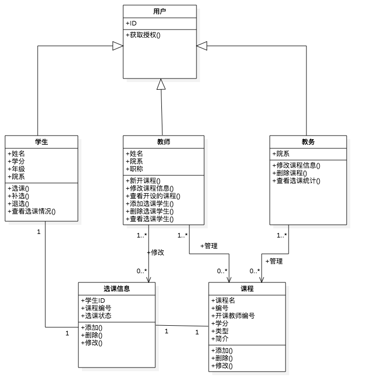
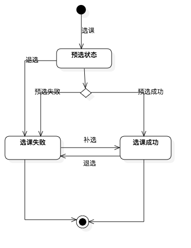
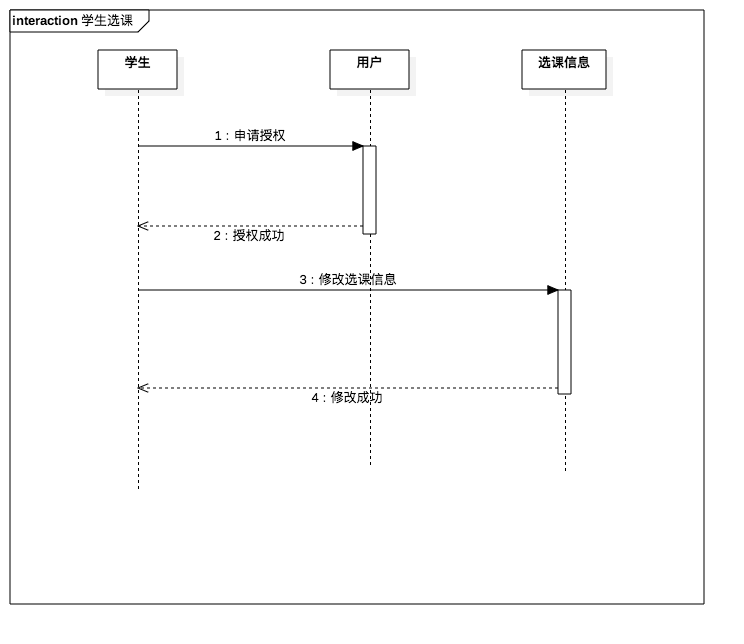

# 选课系统OOA

[选课系统需求描述](https://github.com/Ashlee1994/OO/blob/master/%E4%BD%9C%E4%B8%9A2%EF%BC%9A%E9%80%89%E8%AF%BE%E7%B3%BB%E7%BB%9F%E9%9C%80%E6%B1%82%E8%AF%B4%E6%98%8E%E4%B9%A6.pdf)

[选课系统涉众分析报告](https://github.com/locusxt/oo/blob/master/hw3/%E6%B6%89%E4%BC%97%E5%88%86%E6%9E%90%E6%8A%A5%E5%91%8A.md)

[选课系统需求分析报告](https://github.com/locusxt/oo/blob/master/hw4/%E9%80%89%E8%AF%BE%E7%B3%BB%E7%BB%9F%E9%9C%80%E6%B1%82%E5%88%86%E6%9E%90%E6%8A%A5%E5%91%8A.md)

本系统的设计目标是协助学生提高选课效率以及准确率，以网页方式呈现学生选课系统，提供学生选课在线数字平台。

## 1. 类图

## 2. 状态机图

### 2.1 选课信息状态机图

## 3. 时序图

### 3.1 学生选课

其他时序图与学生选课的时序图类似，不再一一列出

