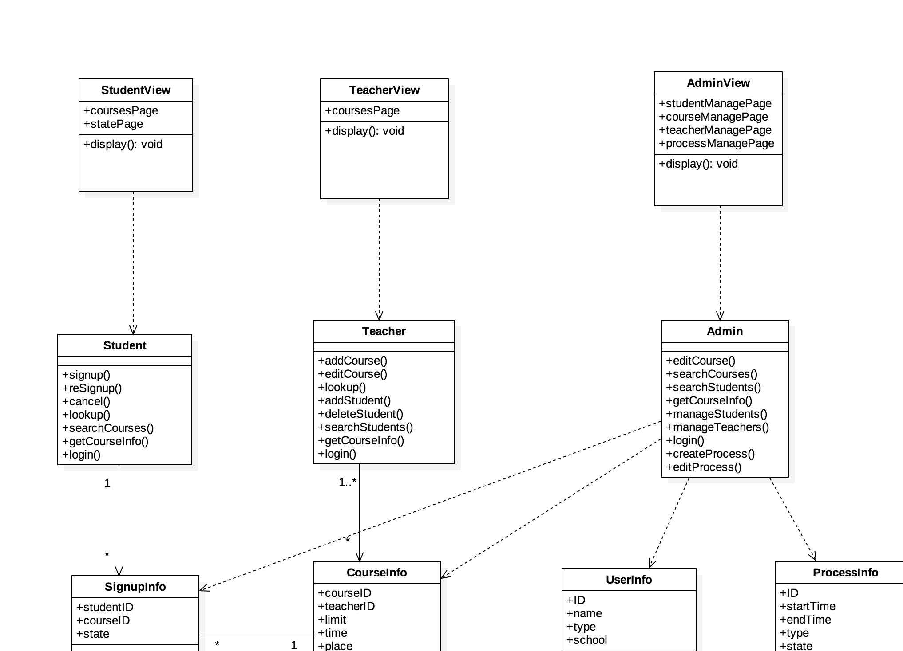

# 选课系统OOD

[选课系统需求描述](https://github.com/Ashlee1994/OO/blob/master/%E4%BD%9C%E4%B8%9A2%EF%BC%9A%E9%80%89%E8%AF%BE%E7%B3%BB%E7%BB%9F%E9%9C%80%E6%B1%82%E8%AF%B4%E6%98%8E%E4%B9%A6.pdf)

[选课系统涉众分析报告](https://github.com/locusxt/oo/blob/master/hw3/%E6%B6%89%E4%BC%97%E5%88%86%E6%9E%90%E6%8A%A5%E5%91%8A.md)

[选课系统需求分析报告](https://github.com/locusxt/oo/blob/master/hw4/%E9%80%89%E8%AF%BE%E7%B3%BB%E7%BB%9F%E9%9C%80%E6%B1%82%E5%88%86%E6%9E%90%E6%8A%A5%E5%91%8A.md)

## 1. 系统概述

本系统的设计目标是协助学生提高选课效率以及准确率，以网页方式呈现学生选课系统，提供学生选课在线数字平台。

本系统以Web应用的形式实现，主要分为服务器端和客户端两个部分。服务器端提供服务，主要包括数据存储、接口等；用户通过Web浏览器进行操作。

## 2. 系统环境

| 框架    | nodejs            |
| ----- | ----------------- |
| 数据库   | mysql             |
| 服务器环境 | osx               |
| 开发语言  | javascript        |
| 客户端   | chrome/firefox/IE |

## 3. 系统设计

### 3.1 类图

### 3.2 数据库表

用户表

| 字段名    | 类型                        | 说明      |
| ------ | ------------------------- | ------- |
| ID     | String                    | 用户的唯一标识 |
| name   | String                    | 用户的姓名   |
| type   | {Student, Teacher, Admin} | 用户的类型   |
| school | String                    | 用户的院系   |

学生选课信息表

| 字段名       | 类型                     | 说明      |
| --------- | ---------------------- | ------- |
| studentID | String                 | 选课学生的ID |
| courseID  | String                 | 课程的ID   |
| state     | {Pre, Success, Failed} | 选课状态    |

课程信息表

| 字段名         | 类型     | 说明      |
| ----------- | ------ | ------- |
| courseID    | String | 课程的唯一标识 |
| teacherID   | String | 开课老师的ID |
| limit       | Int    | 选课人数上限  |
| time        | String | 上课时间    |
| place       | String | 上课地点    |
| description | String | 其他课程描述  |

流程信息表

| 字段名       | 类型                 | 说明      |
| --------- | ------------------ | ------- |
| ID        | String             | 流程的唯一ID |
| startTime | Time               | 开始时间    |
| endTime   | Time               | 结束时间    |
| type      | {预选，补选，补退选，退选}     | 流程的类型   |
| state     | {Active, Inactive} | 流程的状态   |

## 4. 配置要求

服务器：

1. CPU i5 及以上
2. RAM 2GB及以上
3. 磁盘空间40GB及以上
4. 稳定通畅的网络连接

客户端：

1. 网络畅通
2. Chrome、firefox、IE等主流浏览器