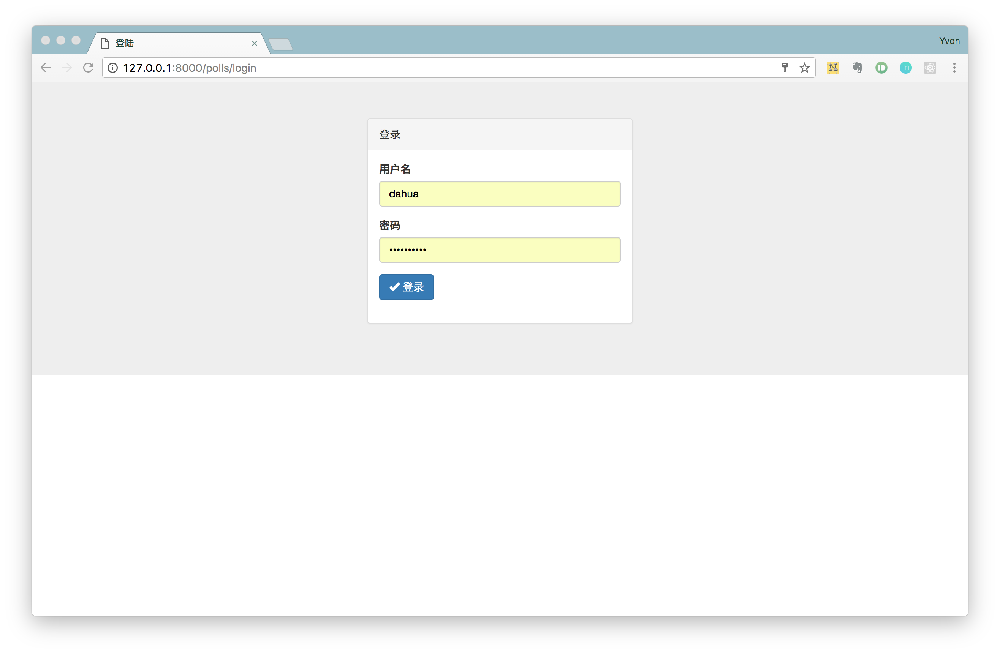
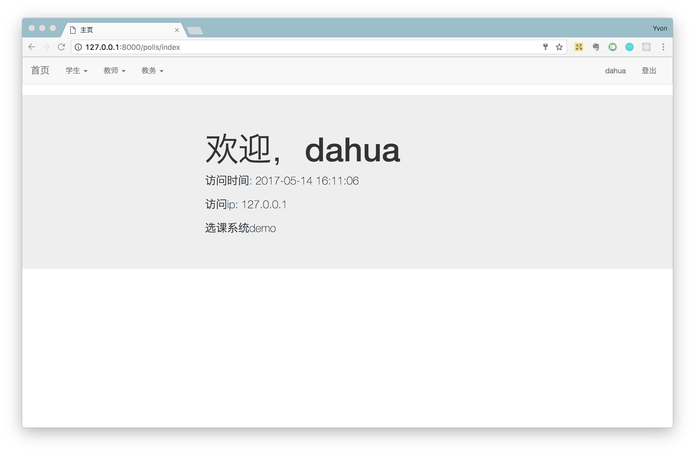
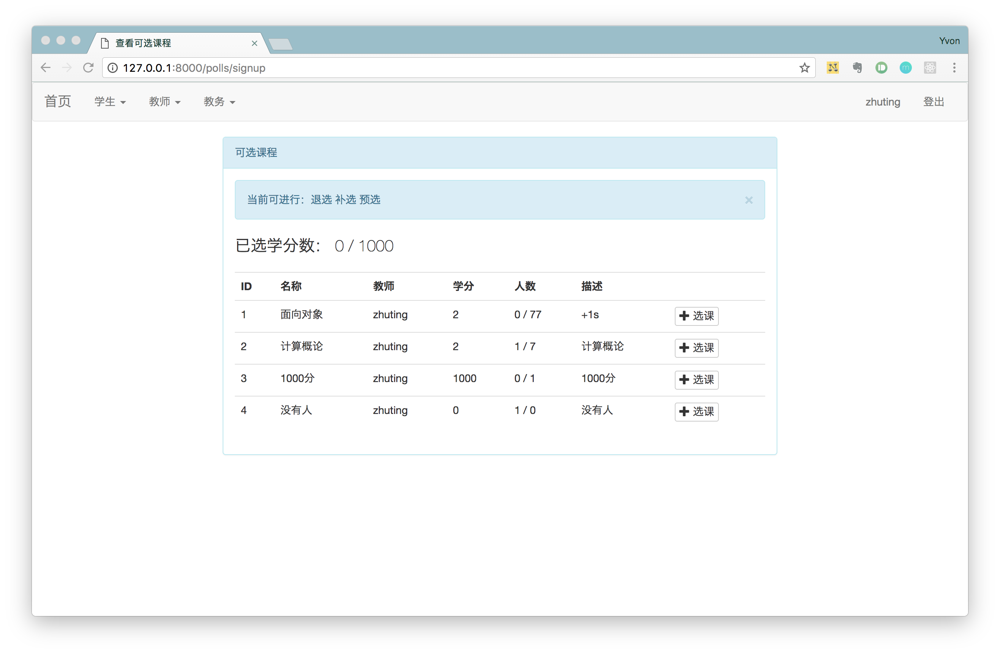
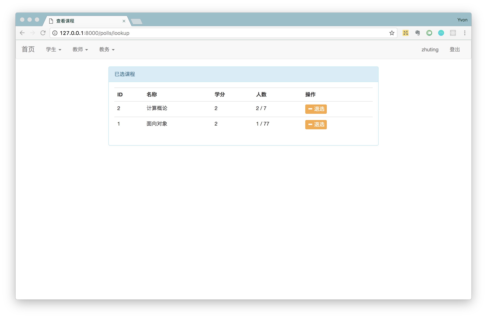
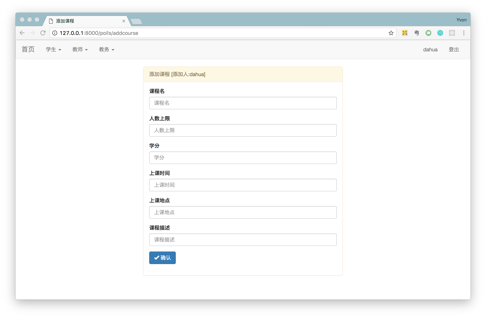
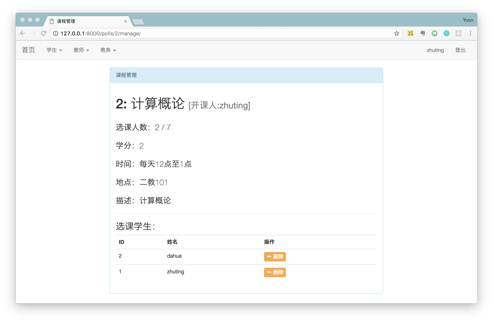
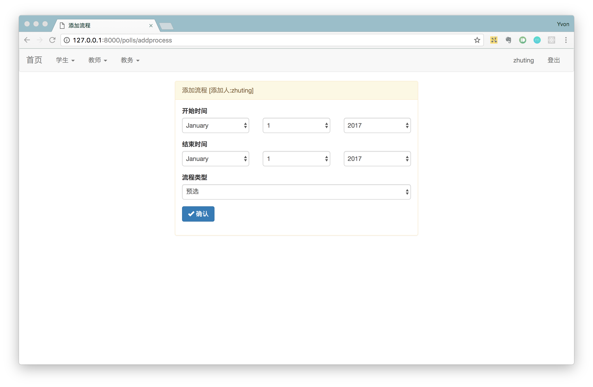
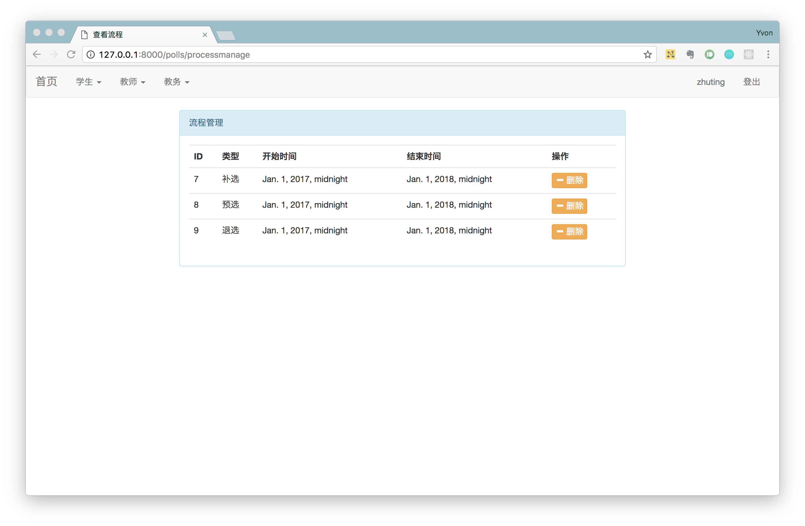

# 选课系统总结报告

[选课系统需求描述](https://github.com/Ashlee1994/OO/blob/master/%E4%BD%9C%E4%B8%9A2%EF%BC%9A%E9%80%89%E8%AF%BE%E7%B3%BB%E7%BB%9F%E9%9C%80%E6%B1%82%E8%AF%B4%E6%98%8E%E4%B9%A6.pdf)

[选课系统涉众分析报告](https://github.com/locusxt/oo/blob/master/hw3/%E6%B6%89%E4%BC%97%E5%88%86%E6%9E%90%E6%8A%A5%E5%91%8A.md)

[选课系统需求分析报告](https://github.com/locusxt/oo/blob/master/hw4/%E9%80%89%E8%AF%BE%E7%B3%BB%E7%BB%9F%E9%9C%80%E6%B1%82%E5%88%86%E6%9E%90%E6%8A%A5%E5%91%8A.md)

[选课系统OOA](https://github.com/locusxt/oo/blob/master/hw5/%E9%80%89%E8%AF%BE%E7%B3%BB%E7%BB%9FOOA.md)

[选课系统OOD](https://github.com/locusxt/oo/blob/master/hw6/%E9%80%89%E8%AF%BE%E7%B3%BB%E7%BB%9FOOD.md)

## 1. 系统概述

本系统的设计目标是协助学生提高选课效率以及准确率，以网页方式呈现学生选课系统，提供学生选课在线数字平台。

[项目代码](https://github.com/locusxt/oo/tree/master/mysite)

## 2. 实现情况

1. 学生：

   基本的补退选、查看已选课程、查看自己当前的学分情况

2. 教师：

   新开课程，查看自己已开的课程，删除自己课程中的学生

3. 教务

   管理选课的流程，控制学生可进行的操作

## 2. 系统展示

**主要**页面展示如下：

1.登录

2.主页

3.选课

4.查看已选课程

5.教师新开课程

6.教师管理课程

7.教务添加流程

8.教务查看已有流程

